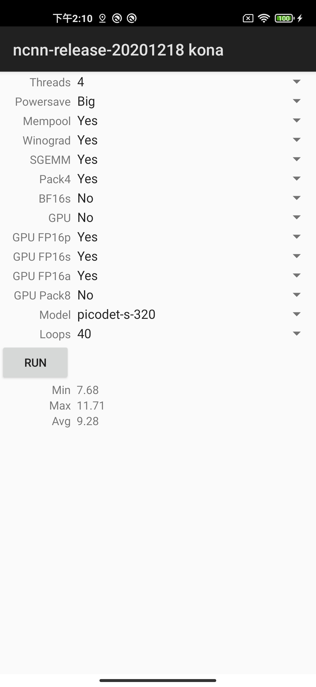

# Mobile Detection Benchmark
This repo is used to test the speed of the mobile terminal models

# Benchmark Result
| Model                        | Input size | mAP<sup>val<br>0.5:0.95 | mAP<sup>val<br>0.5 | Params<br><sup>(M) | FLOPS<br><sup>(G) | Latency<sup>*<sup><br><sup>(ms) | Latency<sup>#<sup><br><sup>(ms) |
| :--------------------------- | :--------: | :---------------------: | :----------------: | :----------------: | :---------------: | :-----------------------------: | :-----------------------------: |
| PicoDet-S                    |  320*320   |          27.1           |        41.4        |        0.99        |       0.73        |              8.13               |            **6.65**             |
| PicoDet-S                    |  416*416   |          30.6           |        45.5        |        0.99        |       1.24        |              12.37              |            **9.82**             |
| PicoDet-M                    |  320*320   |          30.9           |        45.7        |        2.15        |       1.48        |              11.27              |            **9.61**             |
| PicoDet-M                    |  416*416   |          34.3           |        49.8        |        2.15        |       2.50        |              17.39              |            **15.88**            |
| PicoDet-L                    |  320*320   |          32.6           |        47.9        |        3.24        |       2.18        |              15.26              |            **13.42**            |
| PicoDet-L                    |  416*416   |          35.9           |        51.7        |        3.24        |       3.69        |              23.36              |            **21.85**            |
| PicoDet-L                    |  640*640   |          40.3           |        57.1        |        3.24        |       8.74        |              54.11              |            **50.55**            |
| PicoDet-Shufflenetv2 1x      |  416*416   |          30.0           |        44.6        |        1.17        |       1.53        |              15.06              |            **10.63**            |
| PicoDet-MobileNetv3-large 1x |  416*416   |          35.6           |        52.0        |        3.55        |       2.80        |              20.71              |            **17.88**            |
| PicoDet-LCNet 1.5x           |  416*416   |          36.3           |        52.2        |        3.10        |       3.85        |              21.29              |            **20.8**             |

**Attetnion:** * represents NCNN inference speed, # represents Paddle-Lite inference speed.

# Start

## ncnn-android-benchmark

The ncnn android benchmark app

this is a sample ncnn android project, it depends on ncnn library only

https://github.com/Tencent/ncnn

### how to build and run
#### step1
https://github.com/Tencent/ncnn/releases
download ncnn-20201218-android-vulkan.zip or build ncnn for android yourself

#### step2
extract ncnn-20201218-android-vulkan.zip into app/src/main/jni or change the ncnn_DIR path to yours in app/src/main/jni/CMakeLists.txt

#### step3
open this project with Android Studio, build it and enjoy!

### screenshot


# TODO
## TNN、MNN速度补充，欢迎大家贡献

# Refer from
```
git@github.com:nihui/ncnn-android-benchmark.git
```
