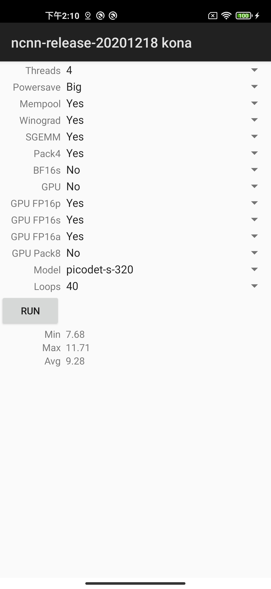

# Mobile Detection Benchmark
This repo is used to test the speed of the mobile terminal models with NCNN

# Requirements
 - NCNN: ncnn-20201218-android-vulkan

# Quick Start

 1. Download [ncnn-20201218-android-vulkan.zip](https://github.com/Tencent/ncnn/releases) or build ncnn for android yourself

 2. Extract `ncnn-20201218-android-vulkan.zip` into `app/src/main/jni` or change the ncnn_DIR path to yours in `app/src/main/jni/CMakeLists.txt`

 3. Open this project with Android Studio, download model param and extract into `app/src/assets`

 4. Add input shape for `Input` layer
    ```
    7767517
    227 252
    Input            data                     0 1 data -23330=4,3,320,320,3 0=320 1=320 2=3
    Convolution      Conv_0                   1 1 data 940 0=24 1=3 11=3 2=1 12=1 3=2 13=2 4=1 14=1 15=1 16=1 5=1 6=648
    ReLU             LeakyRelu_1              1 1 940 424 0=1.000000e-01
    ```
 5. Register all your model `output head` in `app/src/main/jni/model_head.h` and add your model in `app/src/main/jni/benchmarkncnn_jni.cpp`

 6. Run android project and enjoy it !

# screenshot


# Refer from
```
git@github.com:nihui/ncnn-android-benchmark.git
```
